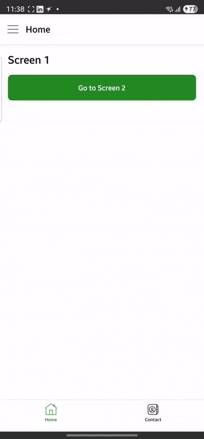

# 📱 React Native Custom Drawer Navigation App

## 🚀 Overview

This project is a demonstration of advanced navigation and UI architecture in **React Native**, designed with modularity and scalability in mind. It highlights my capabilities as a mobile developer, combining:

- 🎨 A **custom animated drawer**
- 🧭 **Bottom Tab + Stack navigation**
- 🌗 **Dynamic theming** (light, dark, system)
- 🧠 **Zustand for state management**
- ⚙️ **TypeScript-first development**

The app follows clean architecture principles and emphasizes maintainability and real-world readiness.

## 📁 Folder Structure

```
src/
  ├── assets/         # PNG icons and logo
  ├── components/     # Reusable UI (Header, Drawer, etc.)
  ├── hoc/            # ThemeProvider HOC
  ├── navigation/     # TabNavigator, StackNavigator, types
  ├── screens/        # Screen1, Screen2, etc.
  ├── store/          # Zustand stores (theme, drawer, screen state)
  └── App.tsx         # Entry point
```

## 🧭 Navigation Structure

```
DrawerNavigator
  └── TabNavigator (Home, Contact)
        ├── StackNavigator (Screen1 → Screen2)
        └── StackNavigator (Screen1 → Screen2)
```

### 🔹 Drawer
- Fully **custom and animated**
- Includes **logo**, **icons**, and **sign-out**

### 🔹 Tabs
- **Home** and **Contact** tabs
- Each tab contains its own **stack**

### 🔹 Stack Header Logic
- **Tab header** shown on first screen (Screen1)
- **Screen header with back button** shown on nested screens (Screen2+)

## 🎨 Theming

The app supports three theme modes:

- 🌞 Light
- 🌙 Dark
- 🌓 System (auto)

Themes are implemented using a custom provider and Zustand to persist user preferences.

## 📦 Assets

Icons located in `src/assets/`:

- `home.png`
- `contact.png`
- `cart.png`
- `favourites.png`
- `order.png`
- `logout.png`

## 🧪 Running the App

### 1. Install Dependencies

```bash
yarn install
# or
npm install
```

### 2. Start Metro

```bash
npx expo start -c
# or for bare RN:
npx react-native start --reset-cache
```

### 3. Run on Device/Emulator

```bash
npx expo run:android   # or: npx react-native run-android
npx expo run:ios       # or: npx react-native run-ios
```

## ✅ Demo Checklist

- [x] Custom drawer with logo and icons
- [x] Drawer animation + sign-out action
- [x] Bottom tabs with icons (Home, Contact)
- [x] Each tab uses a stack (Screen1 → Screen2)
- [x] Tab header on first screen
- [x] Screen header (with back) on nested screens
- [x] Zustand state management
- [x] Light/dark/system theme support
- [x] TypeScript and scalable architecture

## 🎥 Video Demo (GIF Preview)



**What you'll see:**

1. Drawer open/close animations  
2. Navigation: Home ↔ Contact  
3. Stack navigation: Screen1 → Screen2  
4. Dynamic theming toggle

## 🙋‍♂️ About Me

I’m currently exploring new opportunities as a **React Native Developer**. This project reflects my attention to detail, code organization, and ability to build user-focused experiences.

- 📧 Email: abhinav.anand@mosaicwellness.in
- 💼 [LinkedIn](https://www.linkedin.com/in/abhinavanand1310)

## 📄 License

MIT